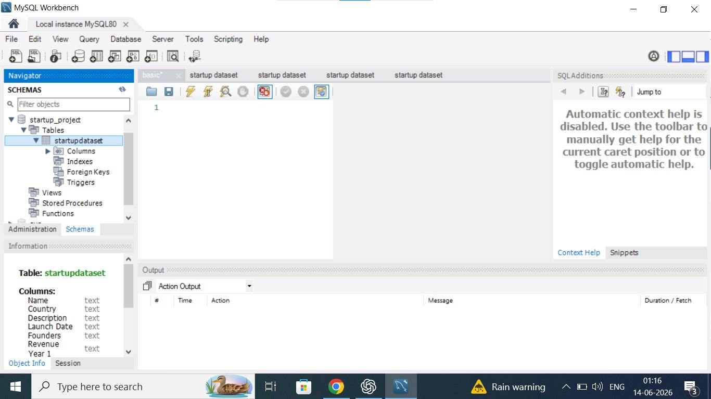
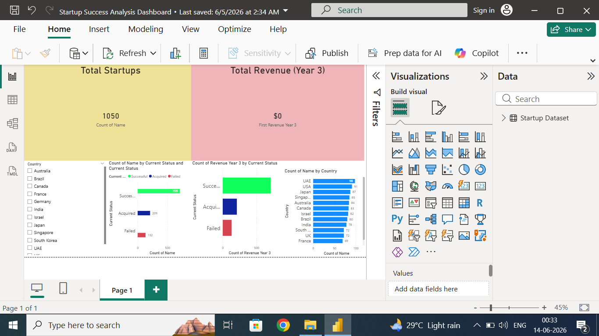

# 🚀 Startup Success Analysis | SQL • Python • Power BI


## 📋 Executive Summary

This project analyzes 1,050 startup records using SQL, Python, and Power BI. The objective was to identify startup success patterns, revenue trends, and country-wise distribution. The analysis revealed that 67.5% of startups were successful, while 19.9% were acquired and 12.6% failed. An interactive dashboard was developed to visualize these business insights clearly and effectively.

## 📌 Project Overview

This project analyzes startup data to identify trends related to startup success, acquisition, and failure. The analysis was performed using SQL, Python, and Power BI to generate meaningful business insights and interactive visualizations.

## 🎯 Objectives

- Analyze startup performance and status.
- Identify startup success patterns.
- Explore country-wise startup distribution.
- Visualize startup trends using Power BI.
- Generate business insights from startup data.

## 🛠️ Tools Used

| Tool | Purpose |
|------|---------|
| MySQL 8.0 | Data storage and querying |
| Python 3.10.11 | Data analysis and visualization |
| Pandas | Data manipulation |
| Matplotlib | Chart generation |
| Power BI | Interactive dashboard |

## 📁 Project Structure

```
startup-success-analysis/
├── data/
│   └── Startup Dataset.csv
├── sql/
│   └── queries.sql
├── python/
│   └── analysis.py
├── dashboard/
│   └── startup_dashboard.pbix
│   └── dashboard.png
│   └── sql.png
└── README.md
```

## 📊 Dataset Information

The dataset contains information about **1050 startups**, including:

| Column | Description |
|--------|-------------|
| Name | Startup name |
| Country | Country of origin |
| Description | Brief description |
| Launch Date | Date of founding |
| Founders | Founder names |
| Revenue Year 1 | Revenue in Year 1 |
| Revenue Year 2 | Revenue in Year 2 |
| Revenue Year 3 | Revenue in Year 3 |
| Current Status | Successful / Acquired / Failed |

## 🔄 Project Workflow

```
Dataset Collection
      ↓
SQL Data Storage & Querying
      ↓
Python Data Analysis & Visualization
      ↓
Power BI Dashboard Development
      ↓
Business Insights & Conclusions
```

## 🗄️ SQL Setup — MySQL Workbench

The dataset was imported into MySQL using a database named `startup_project` with a table called `startupdataset`.



**Table Columns:** Name, Country, Description, Launch Date, Founders, Revenue Year 1, Revenue Year 2, Revenue Year 3, Current Status

## 🐍 Python Analysis

The analysis was done using **Python 3.10.11** with Pandas and Matplotlib.

```python
import pandas as pd
import matplotlib.pyplot as plt

# Load dataset
df = pd.read_csv("Startup Dataset.csv")

# Status distribution
df["Current Status"].value_counts()

# Bar chart - Startup Status
df["Current Status"].value_counts().plot(kind="bar")
plt.title("Startup Status Distribution")
plt.xlabel("Status")
plt.ylabel("Number of Startups")
plt.show()

# Average Revenue over 3 years
df[["Revenue Year 1", "Revenue Year 2", "Revenue Year 3"]].mean().plot(kind="bar")
plt.title("Average Startup Revenue Over 3 Years")
plt.ylabel("Revenue")
plt.show()

# Top 10 countries
df["Country"].value_counts().head(10).plot(kind="bar")
plt.title("Top 10 Countries by Startup Count")
plt.show()

# Revenue vs Startup Success
df.groupby("Current Status")["Revenue Year 3"].mean().plot(kind="bar")
plt.title("Revenue vs Startup Success")
plt.show()
```

### Startup Status Distribution

| Status | Count |
|--------|-------|
| ✅ Successful | 709 |
| 🤝 Acquired | 209 |
| ❌ Failed | 132 |

## 📈 Power BI Dashboard

The dashboard was built in **Power BI Desktop** and includes:

- **Total Startups KPI** — 1050
- **Total Revenue KPI**
- **Startup Status Distribution** (bar chart)
- **Revenue by Current Status** (bar chart)
- **Country-wise Startup Count** (horizontal bar chart)
- **Interactive Country Filter/Slicer**



> **Top Countries by Startup Count:** UAE (98), USA (91), Japan (87), Singapore (85), Australia (84)

## 📊 Results

| Metric | Value |
|--------|-------|
| Total Startups Analyzed | 1,050 |
| Successful Startups | 709 |
| Acquired Startups | 209 |
| Failed Startups | 132 |
| Countries Analyzed | Multiple Countries |
| Dashboard Tool | Power BI |

## 💡 Key Insights

- Successful startups formed the majority (**67.5%** — 709 out of 1050).
- Acquired startups represented a significant proportion (**19.9%** — 209 startups).
- Failed startups accounted for a smaller share (**12.6%** — 132 startups).
- UAE led in startup count with **98 startups**, followed by USA (91) and Japan (87).
- Revenue trends provided clear insights into the performance gap between successful and failed startups.

## ✅ Conclusion

The project successfully demonstrates the use of SQL, Python, and Power BI for startup analytics. The analysis identified startup performance trends and provided business insights through interactive dashboards and data visualization.

## 🔮 Future Enhancements

- [ ] Startup Success Prediction using Machine Learning
- [ ] Advanced Revenue Forecasting
- [ ] Real-Time Startup Analytics
- [ ] Interactive Web Dashboard Deployment

## ▶️ How to Run

### Prerequisites

- Python 3.10.11
- MySQL Server 8.0
- Power BI Desktop

### Steps

1. **Clone the repository**
   ```bash
   git clone https://github.com/your-username/startup-success-analysis.git
   cd startup-success-analysis
   ```

2. **Install Python dependencies**
   ```bash
   pip install pandas matplotlib
   ```

3. **Set up the database**
   - Open MySQL Workbench and run `sql/queries.sql`

4. **Run the Python analysis**
   ```bash
   cd python
   python analysis.py
   ```

5. **Open the Power BI Dashboard**
   - Open `dashboard/startup_dashboard.pbix` in Power BI Desktop

## 📬 Contact

Feel free to connect or raise an issue if you have any suggestions!

## 📚 References

- [Startup Dataset — Kaggle / Public Dataset](https://www.kaggle.com)
- [MySQL Documentation](https://dev.mysql.com/doc/)
- [Pandas Documentation](https://pandas.pydata.org/docs/)
- [Matplotlib Documentation](https://matplotlib.org/stable/index.html)
- [Power BI Documentation](https://learn.microsoft.com/en-us/power-bi/)
